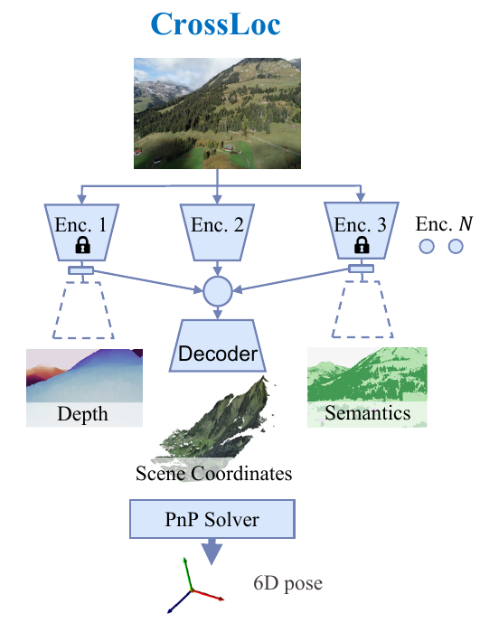

# CrossLoc localization: a cross-modal visual representation learning method for absolute localization

This repository contains the official implementation of the CrossLoc localization algorithm. 

Please make sure you have access to the **CrossLoc Benchmark Raw Datasets** and have set it up properly before proceeding. 

Also check out other useful repos regarding the datasets:

*  [**`CrossLoc-Benchmark-Datasets`**](https://github.com/TOPO-EPFL/CrossLoc-Benchmark-Datasets): CrossLoc benchmark datasets setup tutorial.
* [**`TOPO-DataGen`**](https://github.com/TOPO-EPFL/TOPO-DataGen): an open and scalable aerial synthetic data generation workflow.
* [**`DDLoc`**](https://github.com/TOPO-EPFL/DDLoc): our adapation of ARC method for sim2real coordinate regression

Pretrained network weights and the testing set images could be found as follows:

* [**`oneDrive`**](https://1drv.ms/u/s!AnkbqTET-eNqgoRsgBXkEg-PFSqudA?e=S6Pf43) 
* [**`Google Drive`**](https://drive.google.com/drive/folders/19zIsQBeEvT69DLPbKoojOaG1_uau2VP1?usp=sharing)

Happy coding! :)

<p align="center">
  
</p>


The CrossLoc localization algorithm is officially presented in the paper
<br>
**CrossLoc: Scalable Aerial Localization Assisted by Multimodal Synthetic Data**
<br>
[Qi Yan](https://qiyan98.github.io/), [Jianhao Zheng](https://jianhao-zheng.github.io/), [Simon Reding](https://people.epfl.ch/simon.reding/?lang=en), [Shanci Li](https://people.epfl.ch/shanci.li/?lang=en), [Iordan Doytchinov](https://people.epfl.ch/iordan.doytchinov?lang=en) 
<br>
École Polytechnique Fédérale de Lausanne (EPFL)
<br>
Links: **[arXiv](https://arxiv.org/abs/2112.09081) | [code repos](https://github.com/TOPO-EPFL/CrossLoc)**

##  Get started

### Install dependencies

* If `conda` environment is available:

```bash
conda env create -f setup/environment.yml
conda activate crossloc

cd dsacstar && python3 setup_super.py --conda
# sanity check for DSAC* plugin
python3 -c "import torch; import dsacstar; print('DSAC* installation is fine')"
```

Note: `import torch` must be used before `import dsacstar` in the python script. `conda`  environment is preferred as it handles the low-level opencv dependencies quite easily.

* Otherwise, if `conda` environment is not readily available:

```bash
python3 -m venv venvcrossloc
source venvcrossloc/bin/activate
pip3 install pip -U && pip3 install -r setup/requirements.txt

wget -O opencv-3.4.2.zip https://github.com/opencv/opencv/archive/refs/tags/3.4.2.zip
unzip -q opencv-3.4.2.zip && rm opencv-3.4.2.zip
mkdir -p opencv-build && cd opencv-build
cmake -DCMAKE_INSTALL_PREFIX=install ../opencv-3.4.2
cmake --build . -j12 --target install 
rm -rf ../opencv-3.4.2

export LD_LIBRARY_PATH=$LD_LIBRARY_PATH:$(pwd)/install/lib:$(pwd)/install/lib64
cd ../dsacstar && python3 setup_super.py --cv_path ../opencv-build/install
# sanity check for DSAC* plugin
python3 -c "import torch; import dsacstar; print('DSAC* installation is fine')"
```

Note: 

* Run `export LD_LIBRARY_PATH=$LD_LIBRARY_PATH:$(pwd)/install/lib:$(pwd)/install/lib64` or equivalent commands in shell to add opencv lib directory **EACH** time before `import dsacstar` .

* Due to an [issue](https://github.com/pytorch/pytorch/issues/57273) in `pytorch 1.9.0` stable release, some redundant warning messages may be popped out in the terminal (`Warning: Leaking Caffe2 thread-pool after fork`). Update to nightly pytorch may solve the issue:

  ```bash
  pip3 uninstall torch torchvision torchaudio
  pip3 install pip -U
  pip3 install --pre torch torchvision torchaudio -f https://download.pytorch.org/whl/nightly/cu102/torch_nightly.html
  ```
### Setup datasets

See [CrossLoc Benchmark Datasets Setup](https://github.com/TOPO-EPFL/CrossLoc-Benchmark-Datasets) for details on dataset setup tutorials.

## Training and testing

We propose to 1) pretrain the networks using task-agnostic synthetic data only and then 2) fine-tune the models on specific downstream tasks. 

To be concise, we **only show the steps for `naturescape` datasets** in the main README. Please refer to [another note](notes_crossloc_full_steps.md) detailing the other training, validation and testing steps for `urbanscape` datasets and ablation studies.

### Encoders Pretraining

* Training: task-agnostic `LHS-sim` synthetic data is used (at `train_sim` folder).

```bash
# specify checkpoint weight output path
export CKPT_DIR=$(pwd)/ckpt-weights

# pretrain encoders with LHS-sim data for naturescape
bash script_clean_training/encoder_pretrain.sh naturescape coord FULL 1.0 in_place 0.0 mle 0
bash script_clean_training/encoder_pretrain.sh naturescape depth FULL 1.0 in_place 0.0 mle 0
bash script_clean_training/encoder_pretrain.sh naturescape normal FULL 1.0 in_place 0.0 mle 0
bash script_clean_training/encoder_pretrain.sh naturescape semantics FULL 1.0 in_place 0.0 none 0
```

* Checkpoint selection: we evaluate the model performance on the validation set (at `val_sim` folder) and select the checkpoint models for later training tasks.

```bash
# specify checkpoint weight output path
export CKPT_DIR=$(pwd)/ckpt-weights/$TASK_DIR
# please specify $TASK_DIR for each task, e.g., naturescape-coord-sclean_training-unc-MLE-e100-lr0.0002-sim_only-sc1.00
# otherwise, the validation script may not load the network weight properly

# select model weight based on validation set performance for naturescape
bash script_clean_validation/validate_encoder_pretrain.sh naturescape coord FULL mle 0
bash script_clean_validation/validate_encoder_pretrain.sh naturescape depth FULL mle 0
bash script_clean_validation/validate_encoder_pretrain.sh naturescape normal FULL mle 0
bash script_clean_validation/validate_encoder_pretrain.sh naturescape semantics FULL none 0
# select the checkpoint from the generated path, see script_clean_validation/select_ckpt.py for details
```

### Encoders Fine-tuning

* Training: to fine-tune the encoders with real-synthetic paired date. Note that the pretrained encoders' weights must be spcified in the script. Check the variable `ENC_PRETRAINED` in the `encoder_finetune.sh` script for detailed setup.

```bash
# specify checkpoint weight output path
export CKPT_DIR=$(pwd)/ckpt-weights

# finetune encoders with in-place sim-to-real pairs for naturescape [using 100% LHS-pretrained weights]
bash script_clean_training/encoder_finetun.e.sh naturescape coord FULL 1.0 in_place 1.0 mle 0
bash script_clean_training/encoder_finetune.sh naturescape depth FULL 1.0 in_place 1.0 mle 0
bash script_clean_training/encoder_finetune.sh naturescape normal FULL 1.0 in_place 1.0 mle 0
bash script_clean_training/encoder_finetune.sh naturescape semantics FULL 1.0 in_place 1.0 none 0

# finetune encoders with out-of-place sim-to-real pairs for naturescape [using 100% LHS-pretrained weights]
bash script_clean_training/encoder_finetune.sh naturescape coord FULL 1.0 out_of_place 1.0 mle 0
bash script_clean_training/encoder_finetune.sh naturescape depth FULL 1.0 out_of_place 1.0 mle 0
bash script_clean_training/encoder_finetune.sh naturescape normal FULL 1.0 out_of_place 1.0 mle 0
bash script_clean_training/encoder_finetune.sh naturescape semantics FULL 1.0 out_of_place 1.0 none 0
```

* Checkpoint selection: again, we evaluate the model performance on the validation set (now at `val_drone_real` folder) and select the checkpoint models for later training tasks.

```bash
# specify checkpoint weight output path
export CKPT_DIR=$(pwd)/ckpt-weights/$TASK_DIR
# please specify $TASK_DIR for each task, e.g., naturescape-coord-sclean_training_pt1.00-unc-MLE-e800-lr0.0001-pairs-ip-rc1.00-finetune
# otherwise, the validation script may not load the network weight properly

# select model weight based on validation set performance naturescape data
# please change the $TASK_DIR and repeat for in-place and out-of-place scenes
export MIN_CKPT_ITER=1000000
bash script_clean_validation/validate_encoder_finetune.sh naturescape coord FULL mle 0
bash script_clean_validation/validate_encoder_finetune.sh naturescape depth FULL mle 0
bash script_clean_validation/validate_encoder_finetune.sh naturescape normal FULL mle 0
bash script_clean_validation/validate_encoder_finetune.sh naturescape semantics FULL none 0
# select the checkpoint from the generated path, see script_clean_validation/select_ckpt.py for details
```

### Decoders Fine-tuning

* Training: to reuse the multiple fine-tuned encoders and fine-tune the decoder with real-synthetic paired date. Note that the encoders' weights from the last step must be spcified in the script. Check the variable `ENC_COORD`, `ENC_DEPTH`, `ENC_NORMAL`  and `ENC_SEMANTICS` in the `decoder_finetune.sh` script for detailed setup.

```bash
# specify checkpoint weight output path
export CKPT_DIR=$(pwd)/ckpt-weights

# finetune decoder with in-place sim-to-real pairs for naturescape 
# [using 100% LHS-pretrained + sim-to-real paired data fine-tuned encoders]
bash script_clean_training/decoder_finetune.sh naturescape coord FULL 1.0 in_place 1.0 0.0 in_place 1.0 mle 0
bash script_clean_training/decoder_finetune_plus_semantics.sh naturescape coord FULL 1.0 in_place 1.0 0.0 in_place 1.0 mle 0

# finetune decoder with out-of-place sim-to-real pairs for naturescape 
# [using 100% LHS-pretrained + sim-to-real paired data fine-tuned encoders]
bash script_clean_training/decoder_finetune.sh naturescape coord FULL 1.0 out_of_place 1.0 0.0 out_of_place 1.0 mle 0
bash script_clean_training/decoder_finetune_plus_semantics.sh naturescape coord FULL 1.0 out_of_place 1.0 0.0 out_of_place 1.0 mle 0
```

* Checkpoint selection: again, we evaluate the model performance on the validation set (now at `val_drone_real` folder) and select the checkpoint models for later training tasks.

```bash
# specify checkpoint weight output path
export CKPT_DIR=$(pwd)/ckpt-weights/$TASK_DIR
# please specify $TASK_DIR for each task, e.g., naturescape-coord-decoder_coord_free_depth_normal-senc-pt1.00-ip-ft1.00-unc-MLE-e1000-lr0.0001-pairwise-ip-rc1.00
# otherwise, the validation script may not load the network weight properly

# select model weight based on validation set performance naturescape data
# please change the $TASK_DIR and repeat for in-place and out-of-place scenes
export MIN_CKPT_ITER=1000000  # in-place
export MIN_CKPT_ITER=200000   # out-of-place
bash script_clean_validation/validate_decoder_finetune.sh naturescape coord FULL mle 0
# select the checkpoint from the generated path, see script_clean_validation/select_ckpt.py for details
```

### Performance Testing

Using the model weight selected above, we now run the testing script to evaluate the model's final performance on **testing set**.

```bash
# specify the specific weight path, change this accordingly before running each line
export WEIGHT_PATH=YOUR_PATH

# naturescape, in-place scene
python3 test_single_task.py naturescape --task coord --uncertainty mle --section test_drone_real --network_in ${WEIGHT_PATH}
# naturescape, out-of-place scene
python3 test_single_task.py naturescape --task coord --uncertainty mle --section test_oop_drone_real --network_in ${WEIGHT_PATH}
```

# Citation

If you find our code useful for your research, please cite the paper:

````bibtex
@article{yan2021crossloc,
  title={CrossLoc: Scalable Aerial Localization Assisted by Multimodal Synthetic Data},
  author={Yan, Qi and Zheng, Jianhao and Reding, Simon and Li, Shanci and Doytchinov, Iordan},
  journal={arXiv preprint arXiv:2112.09081},
  year={2021}
}
````